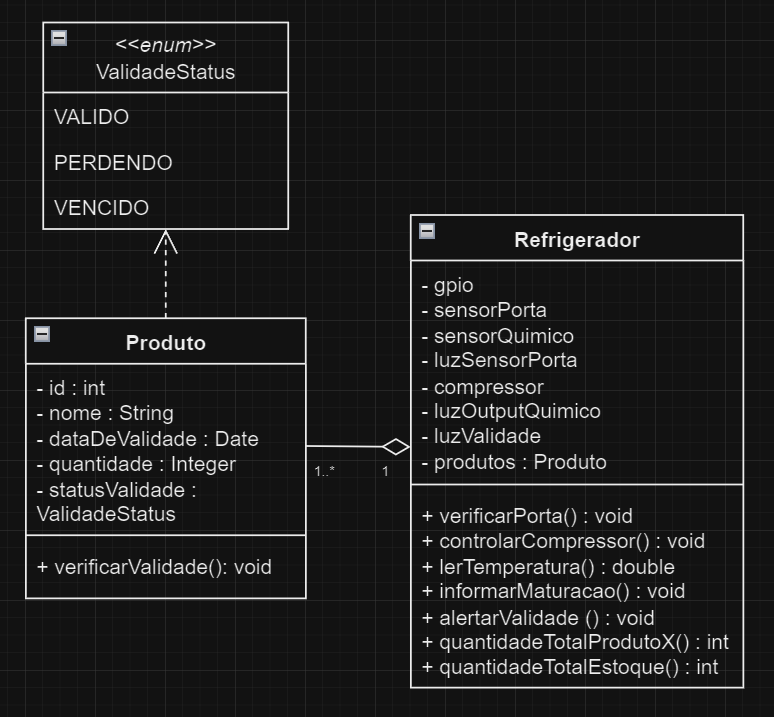

# Usina de Projetos Experimentais - UPX

- Disciplina de desenvolvimento de projetos, realizada na faculdade na [Newton Paiva](https://newtonpaiva.br), segundo período

- Equipe de desenvolvimento:
    + Arthur Abade Nazareth - arthurnz.personal@gmail.com
    + Diogo Silva Lana - diogosilvalana27@gmail.com
    + Lucas César de Lima Amaral - lucascesarlimaral@gmail.com
    + Pedro Lucas Pereira da Silva - plucasilva9@gmail.com

## Proposta e Objetivo:

- Desenvolver um sistema para frigoríficos e sistemas de refrigeração, o qual auxilia na identificação da validade e da maturação dos alimentos, além de contribuir para melhor gestão de estoque por meio do do cadastro de produtos
- Vinculação do software com sensores
- Atender os Objetivos de Desenvolvimento Sustentável, mais especificamente a ODS 12, que trata-se de assegurar padrões de produção e de consumo sustentáveis

    

- Reduzir produção de resíduos orgânicos e de gases efeito estufa, além de evitar o desperdício e a compra excessiva

-----

## Funcionalidades:

O código deste projeto contempla a interação entre o software e os sensores, que monitoram variáveis como temperatura e concentração de gases provenientes da maturação dos alimentos. Ele processa as informações recebidas dos sensores, exibe dados sobre a validade e maturação dos alimentos em uma interface simples (um tablet ou monitor), e emite alertas programados para evitar o desperdício. Também inclui funcionalidades para o controle de estoque, permitindo a quantificação e categorização dos itens armazenados, ajudando na programação da reposição de produtos.

## Modelo:

-----

## Organização dos arquivos:

- `sistema-modelo`: pasta com o código base para o sistema aplicável
- `sistema-contexto`: pasta com o código contextualizado
- `sistema-termial`: pasta com o código como exemplo, rodando no terminal